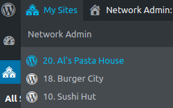

# WordPress Multisite Navigation Plus
Makes administering large WordPress multi-site networks easier by modifying the __My Sites__ menu to display the sites in alphabetical order by name, pre-pended with the blog id. Automatically shows all sites in a network to super admins, no need to manually add them to each site.

## Change Log
+ __April 30, 2020__: Updated to include searchbar to search through sites.

+ __April 19, 2019__: Updated to show all sites in a network to super admins. Regular admins and other users still only see the sites they belong to.
